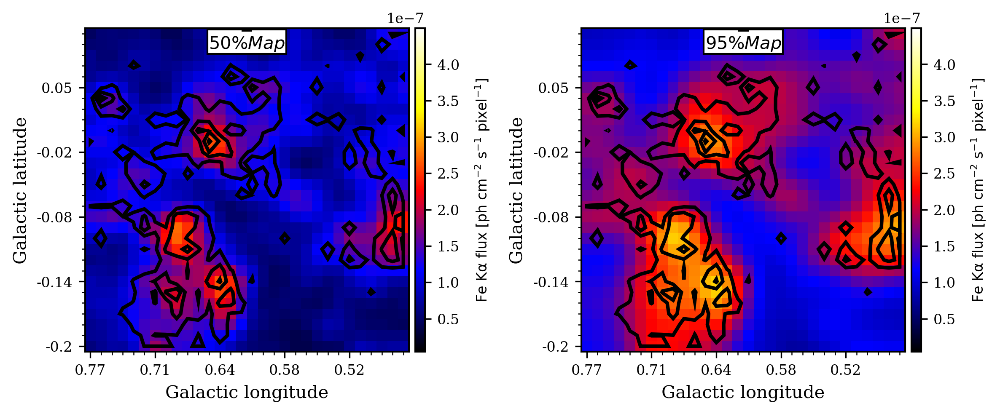

# Diffuse Steady X-ray Emission
This repository contains scripts and methods designed for extracting uniform baseline diffuse X-ray emission from the Central Molecular Zone (CMZ), focusing on the Sgr B molecular cloud region.


### Part 1: Main Pipeline: Scripts for 6.4 keV Emission - 

This directory contains the standard data reduction pipeline, originally developed by *Terrier et al. (2018)*, for processing XMM-Newton data and generating continuum-subtracted 6.4 keV mosaics for each epoch.

The *Terrier et al. (2018)* scripts have been updated to Python 3 and adapted for execution on the *IPAG computer cluster*. This version uses remote server interactions and includes updated file locations as follows.

```bash
remote_user="dehiwald"  # replace with different user
remote_host="ipag-oar.u-ga.fr"
remote_dir="/user/home/dehiwald/workdir/galactic_center/XMM_scripts_python"  # modify with the local directory 
```
Make sure that the following directories are **replaced** in each script:

```bash
export WORKDIR=/user/home/dehiwald/workdir/galactic_center/XMM_scripts_python
export DATAPATH=/user/home/dehiwald/workdir/galactic_center/data
export ANAPATH=/user/home/dehiwald/workdir/galactic_center/analysis
```


### Script List (located at `WORKDIR`):
1. **NXSA-Results-1646402050141.txt** : The target observation table for a region of interest (Sgr B) as obtained from the XMM Science Archive. 

2. **ssl_download.sh** (New script, 2024): Download and extract ODF of all the observations from the XMM Science Archive to the specified location on the IPAG cluster as:

```bash
export DATAPATH=/user/home/dehiwald/workdir/galactic_center/data
```

3. **prep_obs_imalist.py** (New script, 2024) : Generates job IDs as epoch lists and image lists from the observation table at the `WORKDIR`.  

   **Output :**  
   - `SgrbXXXX.list` (where XXXX corresponds to epochs from 2000 to 2020)  
   - `ima-SgrbXXXX.list` (counts images for each observation ID in each epoch)


4. a). **ssl_launch_esas_job_ima_mosa.sh** (Updated from terrier et al. (2018))  
   b). **ssl_setenv_ima.sh** (Updated from terrier et al. (2018))  
   c). **ssl_esas_analysis.sh** (Updated from terrier et al. (2018))  
  
 **Output:**  
   This pipeline processes XMM-Newton observations and generates science products including background counts, exposure, and image count files.


5. `make_mosa_sub.sh` : This script is invoked as the second loop in `ssl_launch_esas_job_ima_mosa.sh` to rebin the original count image and zoom into the required region (e.g., Sgr B).
```bash
if [ $name == 'SgrB2' ]; then
    ra=266.86174642
    dec=-28.42722147
    angle=58.72

    if [ $rebin == '30arcsec' ]; then
        xsize=40
        ysize=40
        pixel=30
    fi
fi
```

5. a). **FeEff_cannedRMF.py** (Updated from Terrier et al. (2018))  
   b). **smosa_eff.py** (Updated from Terrier et al. (2018))  
   c). **execute.py** (New script, 2024)  

**Output:**  
   This pipeline processes scientific products (background counts, exposure maps, and image count files) to estimate the 6.4 keV continuum. It then subtracts the continuum to create continuum-subtracted 6.4 keV fluorescence maps. Use **execute.py** to automate the entire pipeline.


**Note:**  

1. If `make_mosa_sub.sh`  does not work within `ssl_launch_esas_job_ima_mosa.sh` then skip the command `source $WORKDIR/ssl_esas_analysis.sh  $obs` in LOOP 1 and rerun the  `ssl_launch_esas_job_ima_mosa.sh`. 


2. The scripts were initially written for an older version of SAS (19). Newer versions (21+) require significant modifications. However, the IPAG cluster uses a Dockerized version of SAS that uses the SAS19 compatible version.


### Part 2: Morphology of Steady Emission - 

This directory contains statistical methods developed by Maica, Gilles, and Dilruwan for extracting baseline steady X-ray emission from the GC using the continuum-subtracted 6.4 keV XMM-Newton flux maps (rebinned to 30 arcseconds, zoomed into Sgr B). The maps can be found in the **maps_eff/** directory, which is the output from **Part 1**.  Make sure this directory is placed in the same location as the scripts.

### Script List (located in the local/IPAG directory):

The following scripts have been created to extract the steady emission for each pixel in the continuum-subtracted 6.4 keV XMM-Newton maps. These scripts and the **maps_eff/** directory can be uploaded to the IPAG cluster for *parallel* execution.

```markdown
1. # Project Code Organization

- main.py
  - data.py
  - density_cal.py
  - intersections.py
  - ccdf.py
  - pmf.py
  - plots.py
  - pmf.py
  - plot_steady_maps.py
  - Poisson_Maps.py
```

2. **main.py** processes all 900 pixels in parallel. It handles n epochs per pixel (Total 900 x n calculations). The script first extracts the data for these n epochs. This inputs include the continuum levels (μ_cont) and the total number of photons (N_tot) for each epoch. Then, the script calculates the probability density function (p.d.f.) of the 6.4 keV line using Bayesian probability and subsequently computes the complementary cumulative distribution function (CCDF) as the p.d.f. of the steady emission for each epoch. After obtaining each p.d.f., a minimum curve is obtained to represent the p.d.f of steady emission across all n epochs. The rejection estimation criteria are also applied, and the 50% and 95% values are obtained as estimation of the steady emission.

**Output:**  
This pipeline processes all 900 pixels and creates two text files: 
- `filtered_intersections.txt`: Contains array-like values for the 50% and 95% estimations after rejection.
- `unfiltered_intersections.txt`: Contains array-like values for the 50% and 95% estimations before rejection.

Run *plot_steady_maps.py* to create standard FITS files using these values:

- `mosa_steady_map_50lim_30arcsec.fits`: Represents the FITS values of the 50% steady estimation for the Sgr B region.
- `mosa_steady_map_95lim_30arcsec.fits`: Represents the FITS values of the 95% steady estimation for the Sgr B region.



*Estimation of the Upper Limit for Steady X-ray Emission from the Sgr B Molecular Cloud: 50% estimation (left) and 95% estimation (right)*


3. **Poisson_Maps.py** processes all 900 pixels in each epoch to create Poisson maps. These Poisson maps replaces the continuum-subtracted 6.4 keV line by the density-estimated 6.4 keV flux. These Poisson maps are are used to extract the spectrum of the steady emission in **Part 3:**. 

**Note:**

1. Use the following function in **main.py** to test a single epoch:

    ```python
    if __name__ == "__main__":
        if len(sys.argv) > 1:
            i = int(sys.argv[1])
            print(f"The Pixel number: {i}")
            MAIN(i)
        else:
            print("No variable passed as argument. Please provide an index value.")
    ```

2. Also, use:

    ```python
    plot_result(index, years, filtered_years, data, x_common, interpolated_y_values, x_common_filtered, interpolated_y_values_filtered, old_intersections, new_intersections)
    ```

In line:350 in **main.py** to generate plots. This function will plot the probability density of the 6.4 keV line, the steady emission, the steady emission after applying the rejection criteria, and the Poisson light curve for a single pixel.


*Probability density curves for line emission, represented by dP_total / dμ_line as a function of μ_line, for Pixel_{i=15, j=8} in the data cube (see Figure \ref{fig:datacube}) on the left. The probability density curves for the steady emission, or dP_steady / dμ_steady as a function of μ_steady, are represented as the CCDF of the line on the right. The combined density of the steady emission is plotted in black, representing the minimum of each density curve.*


3. Refer to [README_Simulations.md](Documentation/README_Simulations.md) for code explanation on estimating steady emission using **simulated data**.


### Part 3: Spectroscopy of Steady Emission - 

The pipeline for spectra extraction is not automated. As sgr B region used 6 observations I have create 6 directories with the neccesiory script to process spectral extraction .However when number of observations  get larger this process has to be automated 


### Script List (located in the local/IPAG directory):

The following scripts have been created to extract the steady spectra for pixels compatible with steady emission. These scripts and the **maps_eff/** directory can be uploaded to the IPAG cluster for *parallel* execution.


## Directory Structure

```bash
├── galactic_center/
│   ├── analysis/                # Main analysis scripts and tools
│   │   ├── subdir1/             # [Description of what subdir1 contains]
│   │   ├── subdir2/             # [Description of what subdir2 contains]
│   │   ├── subdir3/             # [Description of what subdir3 contains]
│   │   ├── subdir4/             # [Description of what subdir4 contains]
│   │   ├── subdir5/             # [Description of what subdir5 contains]
│   │   └── subdir6/             # [Description of what subdir6 contains]
│   ├── data/                    # Processed data and database-related files
│   ├── XMM_scripts_python/      # Python scripts for XMM-Newton data analysis
│   ├── docs/                    # Documentation for the project
│   └── README.md                # Project documentation and overview
