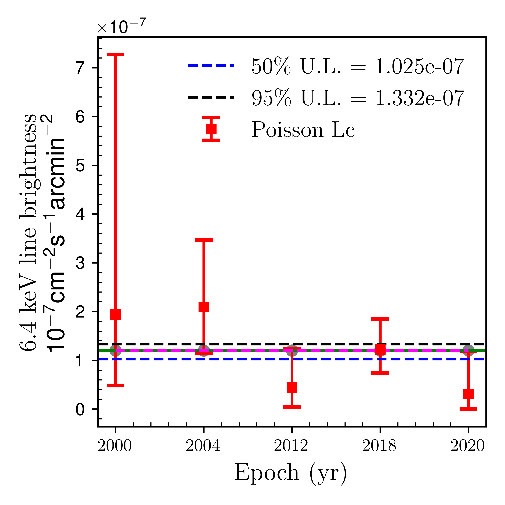

# Simulated Case for 6.4 keV Line Patterns

This simulation analyzes various patterns of the 6.4 keV line (such as increasing, decreasing, constant, and peak) across five epochs. The goal is to understand the expected steady emission for the simulated 6.4 keV line.

### Assumptions
The simulation generates photon counts based on real observation times, with the following specific assumptions regarding the photon rates:

- **Constant Continuum Levels (`muc`)** (array-like): \(8 	imes 10^{-8} \, 	ext{ph cm}^{-2} 	ext{s}^{-2}\)
- **Real Observation Time (`EXP`)** (array-like): 
  ```python
  exp = [10318996.1408372, 83623801.91439006, 112838731.22452486, 257356538.3407589, 80569410.54103501]
  ```
- **Simulated 6.4 keV Line Rates (`mul`)** (array-like): [Provide specifics about these values.]

### Expected Photon Counts

The expected photon counts are computed as follows:

```python
expected_photons_cont = [n * u for n, u in zip(muc, EXP)]
expected_photons_line = [n * u for n, u in zip(mul, EXP)]
```

### Simulation Logic

The simulation iterates through the expected photon counts and generates Poisson random variables to simulate the observed counts:

```python
ntot = []
nc = []

for i, j in zip(expected_photons_cont, expected_photons_line):
    poisson_RV_muc = np.random.poisson(i, 1)[0]
    poisson_RV_mul = np.random.poisson(j, 1)[0]

    ntot_value = poisson_RV_muc + poisson_RV_mul
    ntot.append(ntot_value)
    nc.append(poisson_RV_muc)
```

### Outputs

After running the simulation, the following outputs are generated:
- **Total Counts (`ntot`)**: The sum of the constant and line photon counts.
- **Expected Photon Counts for Continuum (`expected_photons_cont`)**.
- **Expected Photon Counts for Line (`expected_photons_line`)**.

## Results

### Case 1: Constant 6.4 keV Line

In this case, the photon counts are simulated with the following values:

- **Constant Continuum Levels (`muc`)**: `[8e-8, 8e-8, 8e-8, 8e-8, 8e-8]`
- **Simulated 6.4 keV Line Rates (`mul`)**:`[12e-8, 12e-8, 12e-8, 12e-8, 12e-8]` 


#### Simulation Outputs

- **Total Counts (`ntot`)**: `[3, 24, 14, 52, 9]`  
- **Counts from Continuum (`nc`)**: `[0.83, 6.69, 9.03, 20.59, 6.45]`   


#### Steady emission level estimation 


*Caption for Image 2*





This text will wrap around the image and the caption. You can continue typing here, and the text will automatically flow around the image on the right. This text will wrap around the image and the caption. You can continue typing here, and the text will automatically flow around the image on the right. This text will wrap around the image and the caption. You can continue typing here, and the text will automatically flow around the image on the right.

|  | 
This text will wrap around the image and the caption. You can continue typing here, and the text will automatically flow around the image on the right. This text will wrap around the image and the caption. You can continue typing here, and the text will automatically flow around the image on the right. This text will wrap around the image and the caption. You can continue typing here, and the text will automatically flow around the image on the right.
. |
|---------------------------------|--------------------------------|


*Caption for Image 1*


---

