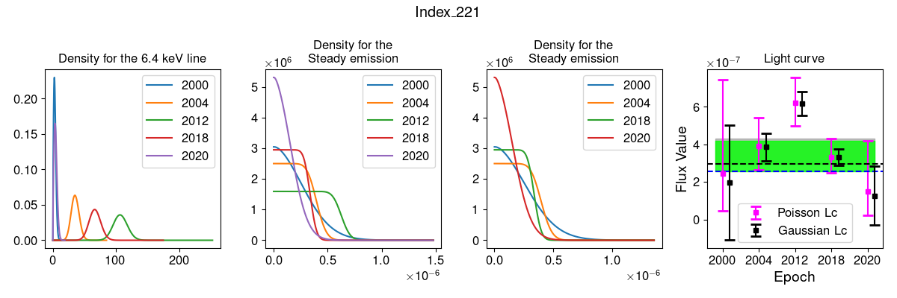

# Documentation for `compute_ccdfs` Function

## Overview
The `compute_ccdfs` function computes the Complementary Cumulative Distribution Functions (CCDF) from a given dataset of y-values (probability density), x-values, and an exp flag. The function returns a list of CCDFs for each data entry.

Welcome to my project!

Here is a cool diagram showing the architecture:



Hope you like it!


## Mathematical Background

### CCDF Definition
The CCDF is defined as:
\[
\text{CCDF}(x) = 1 - \text{CDF}(x)
\]

### CDF Approximation
The CDF is approximated using numerical integration. The approximation formula is:
\[
\text{CDF}(x) = \int_{-\infty}^{x} f(t) \, dt \approx \sum (0.5 \cdot (y_i + y_{i+1}) \cdot dx)
\]
Where:
- \( y \): Probability density function values.
- \( x \): Corresponding x-values.
- \( dx \): Differences between consecutive x-values.

### Steps in the Function
1. **Input Parameters**:
   - `data`: List of tuples, where each tuple contains (y_values, x_values, exp_value).

2. **Computation Process**:
   - If `exp_value` is non-zero, compute the CCDF:
     - Calculate the differences between consecutive x-values.
     - Use the trapezoidal rule to approximate the areas under the curve.
     - Compute the cumulative sum of these areas to get the CDF.
     - Clip the CDF values to ensure they lie within [0, 1].
     - Calculate the CCDF as \( 1 - \text{CDF} \).

3. **Output**:
   - Returns a list of CCDFs corresponding to each dataset.

## Usage
To use the function, pass a list of tuples where each tuple contains the y-values, x-values, and the exp flag. 

Example:
```python
data = [(y_values1, x_values1, exp1), (y_values2, x_values2, exp2)]
ccdfs = compute_ccdfs(data)
